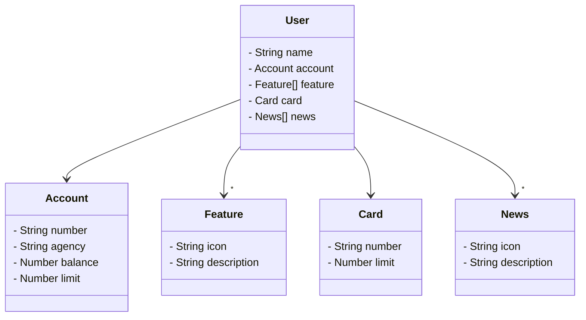

# Desenvolvido durante o bootcamp Decola Tech 2025, pela DIO.

## Diagrama de Classes

```mermaid
classDiagram
    class User {
        - String name
        - Account account
        - Feature[] feature
        - Card card
        - News[] news
    }
    
    class Account {
        - String number
        - String agency
        - Number balance
        - Number limit
    }
    
    class Feature {
        - String icon
        - String description
    }
    
    class Card {
        - String number
        - Number limit
    }
    
    class News {
        - String icon
        - String description
    }
    
    User --> Account
    User --> "*" Feature
    User --> Card
    User --> "*" News
```
